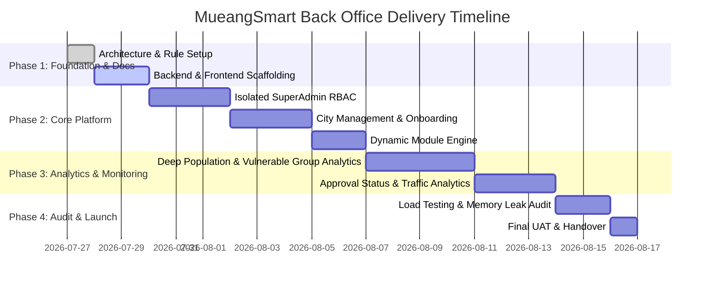

# Project Manager Execution Strategy & Governance Plan

**Project:** MueangSmart SuperAdmin Back Office Platform  
**Target Architecture:** Multi-Tenant Smart City Enterprise Operations & Deep Analytics Console  
**Lead:** Senior Enterprise Project Manager  

---

## 1. Executive Summary (สรุปสำหรับผู้บริหาร)

โครงการพัฒนาระบบ **MueangSmart SuperAdmin Back Office** มีวัตถุประสงค์เพื่อยกระดับความสามารถในการบริหารจัดการเมืองอัจฉริยะแบบภาพรวมระดับประเทศ (Multi-Tenant SuperAdmin Console) สำหรับติดตาม ควบคุม และวิเคราะห์ข้อมูลเมืองทุกแห่งในระบบ MueangSmart 

ระบบนี้สร้างขึ้นโดยเน้นย้ำเรื่อง **Production Safety, Zero Impact on Existing System, High Performance, และ Deep Analytics Capabilities** โดยระบบ SuperAdmin User และ RBAC Management จะถูกแยกโดเมนออกเป็นอิสระโดยสมบูรณ์ ไม่กระทบกระเทือนตารางผู้ใช้หน้าบ้านเดิมใน Production 

---

## 2. Strategic Goals & Scope Management

### 2.1 Key Scope Deliverables (ขอบเขตงานหลัก 6 ด้าน)

1. **Enterprise City Management Dashboard:**
   - Visualizing สถานะเมืองทุกแห่งในประเทศไทย (Active / Maintenance / Suspended)
   - GIS Map View & Data Table เปรียบเทียบตัวเลขประชากร สถิติ และการเปิดใช้งานโมดูล
2. **Isolated SuperAdmin RBAC Control System:**
   - การสร้างและจัดการบัญชี SuperAdmin ประจำ platform (แยกจาก `AdminUsers` หน้าบ้าน)
   - การกำหนด Granular Permission Matrices (Read / Write / Analytics / System Management)
3. **Automated City Onboarding System:**
   - ระบบเพิ่มเมืองใหม่ผ่าน Interactive Form Wizard ปลอดภัย 100% แทนการยิง Raw SQL Manual 
   - ระบบตั้งค่าพิกัด Lat/Long, โลโก้, ข้อมูลการติดต่อ และการสร้างการตั้งค่าเริ่มต้น
4. **Dynamic Module Activation Engine:**
   - สวิตช์ควบคุมเปิด/ปิด Module รายเมืองแบบ Real-Time (เช่น ผู้ป่วยติดเตียง, ร้องเรียน, ชำระภาษี, แจ้งเตือนระดับน้ำ ฯลฯ)
5. **Tenant Local Admin Management:**
   - ระบบจัดการบัญชีผู้ดูแลระบบประจำเมือง (Local Admin / `AdminUsers`) เพื่อช่วยเหลือและตรวจสอบสิทธิระดับเมือง
6. **Platform Monitoring & Deep Population Analytics:**
   - **Vulnerable Group Deep Monitoring:** สถิติผู้สูงอายุ, ผู้พิการ, ผู้ป่วยติดเตียง, ประวัติการประเมินและการร้องขอความช่วยเหลือ
   - **User Registration & Approval Status Analytics:** ติดตามผู้ลงทะเบียนใช้งาน จำแนกตาม Approved / Pending Approval / Rejected
   - **Module Operational Analytics:** ติดตามเรื่องร้องเรียน (Complaints SLA), ยอดชำระภาษี/ค่าขยะ, การเตือนภัยระดับน้ำ IOT
   - **Traffic & Channel Analytics:** เปรียบเทียบสถิติการใช้งาน Web App vs Mobile App (เมืองสมาร์ท)

---

## 3. Work Breakdown Structure (WBS) & Sprint Milestones

---

## 4. Risk Governance & Safety Safeguards (การบริหารความเสี่ยง)

| ความเสี่ยง (Risk) | ระดับความสำคัญ | มาตรการป้องกันและแก้ไข (Mitigation Strategy) |
|---|---|---|
| **ผลกระทบต่อ Production DB เดิม** | **CRITICAL (สูงสุด)** | ห้ามสั่ง Auto-Migration หรือแก้ DDL ตารางเดิมเด็ดขาด ใช้เฉพาะ Read-Only/Safe Transactions ผ่าน Go Backend |
| **ความสับสนเรื่อง สิทธิผู้ใช้งาน** | **HIGH** | แยกตาราง SuperAdmin ของ Back Office ออกมาใช้ `bo_*` prefix เด็ดขาด ไม่ใช้ตาราง `AdminUsers` หน้าบ้าน |
| **DB Latency จากการคำนวณ Analytics** | **HIGH** | ใช้ Aggregation Queries ที่ผ่านการสร้าง Indexing Awareness, มี Caching Layer และ On-Demand Fetching |
| **Memory Leak บน Backend/Frontend** | **MEDIUM** | บังคับใช้ pprof profiling บน Go Fiber v3 และบังคับใช้ Cleanup Handlers บน React 19/Next.js 15+ Components |

---

## 5. Quality Assurance & KPI Acceptance Criteria

1. **Performance Standard:** Latency การโหลด API Dashboard ต้องต่ำกว่า 150ms (Zero Bottleneck)
2. **Quality Audit Passed:** 
   - `go vet ./...` ผ่าน 100% ปราศจาก Warning
   - `tsc --noEmit` & `pnpm lint` ผ่าน 100% ปราศจาก Type Error
   - Unit Test Coverage > 80% สำหรับ Business Logic
3. **Documentation Updated:** มีการบันทึกสรุปความคืบหน้า และอัปเดต Walkthrough ทุกครั้งที่มีการพัฒนา
